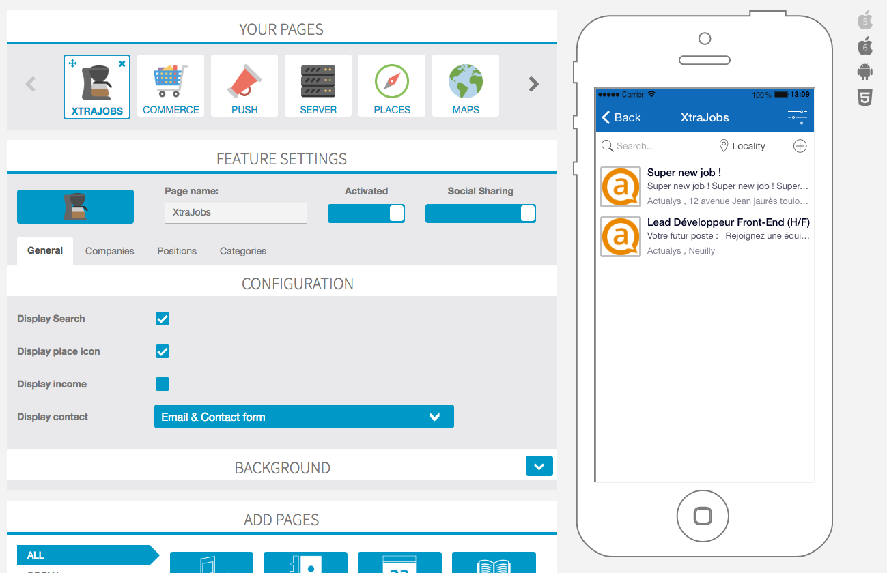
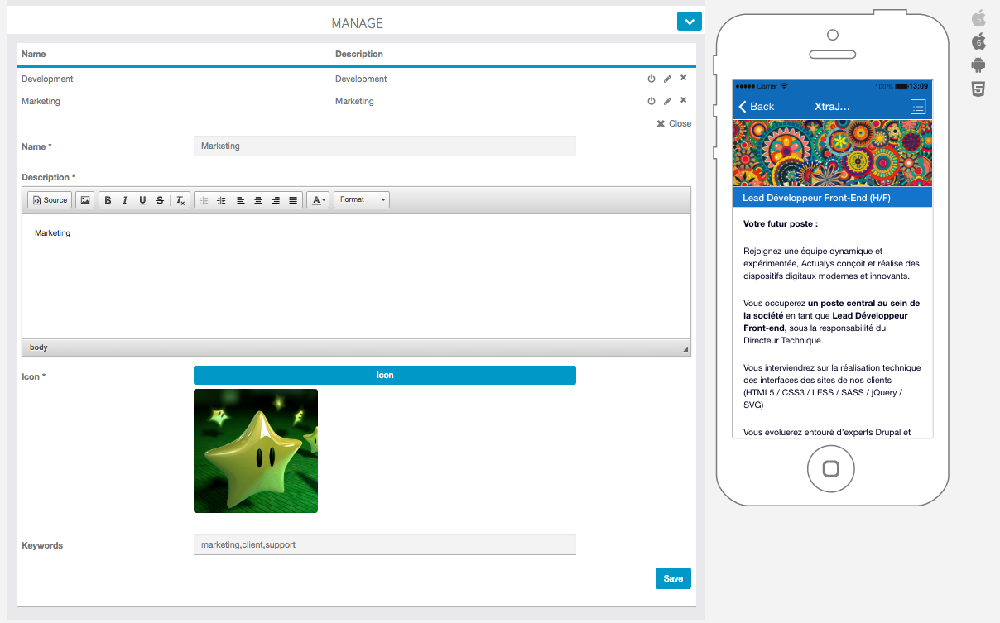

# Siberian module Skeleton, #JOB

This module is given as-is, and is intended to be used as a start / all-in-one base for creating rich modules.

To build the module, you must read the documentation on how to create your package

https://developers.siberiancms.com/module/#package

Downloading the package from github as zip will not work

##  However this feature is incorporated in all Siberian Editions (From 4.6.2).

